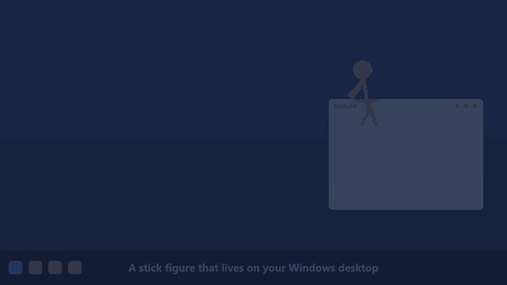

# Mascotte Stickman



Un bonhomme-bâton qui vit sur le bureau de Windows : il se promène, saute sur le haut des fenêtres, danse, se bat contre le curseur, bâtit des tours de blocs, s'envole en élytres… et on peut l'attraper à la souris pour le lancer. Il n'a aucune image : tout est dessiné par le programme à partir d'un squelette, ce qui permet de choisir sa couleur et de lui donner des centaines d'animations.

*[English version](README.md)*


> **Projet de fan, non officiel.** L'idée vient des animations où un stick figure s'échappe de son logiciel de dessin et sème la pagaille sur le bureau, celles d'Alan Becker en tête. Ce projet n'est ni créé ni approuvé par lui. Minecraft est une marque de Mojang ; ce projet n'y est pas affilié et ne contient aucun fichier du jeu.

## Installer

Télécharger `MascotteStickman.exe` dans les [Releases](../../releases) et le lancer. Windows 10 ou 11, rien d'autre à installer.

L'exe n'est pas signé (un certificat de signature est payant) : Windows peut afficher « Windows a protégé votre ordinateur ». Cliquer sur *Informations complémentaires* puis *Exécuter quand même*. Pour qui préfère ne pas faire confiance à un téléchargement : chaque release donne l'empreinte SHA-256 de son exe, tout le code est dans ce dépôt, et `construire.ps1` fabrique le même programme sur votre PC avec le compilateur livré avec Windows.

## Ce qu'il fait

- **Clic droit** : couleur, animations rangées par famille, amis, paramètres, mode muet, lancement au démarrage de Windows, quitter.
- **Couleur et tête** : 16 teintes ou n'importe quelle couleur. La tête est un disque plein, sauf pour l'orange, le noir et le rouge sombre où c'est un anneau ; un réglage force l'un ou l'autre.
- **1 795 animations** : déplacements, danses (54 mouvements de bras × 15 de jambes, et aussi valse, french cancan, sirtaki, haka…), gestes, combat (avec des enchaînements de deux et trois coups), acrobaties (saltos et roues enchaînés, certains au ralenti), sport, vie quotidienne, émotions, et quelques-unes réservées au bord des fenêtres (assis, jambes dans le vide, pêche à la ligne). Une quarantaine d'accessoires dessinés par le programme : épée, marteau, guitare, parapluie, balai…
- **Souris** : on l'attrape, on le balance, on le lance ; il se bat contre le curseur s'il s'approche, et un curseur trop rapide l'envoie valser.
- **Fenêtres** : il saute sur le haut des fenêtres (saut simple, salto ou atterrissage de héros), voyage avec elles, et retombe si elles se ferment.
- **Amis** : jusqu'à six stickmen à la fois (clic droit → *Amis* → *Ajouter un stickman*), chacun de sa couleur. Ils vont se voir d'eux-mêmes, même perchés sur des fenêtres différentes : bonjour, check, tope-là, poignée de main, check complet, câlin, pierre-feuille-ciseaux, duel amical, tchin, check du pied, ola, concours de pompes, le tope-là « trop lent ! », danse à deux… Ils s'applaudissent aussi, jouent à tape-mains, font un bras de fer, se disputent et se réconcilient. Vingt-trois animations à deux.


- **Musique** : quand le PC joue de la musique, il lui prend de temps en temps l'envie de danser, et sa danse suit le tempo. Il lit seulement le niveau du son qui sort du PC (comme l'indicateur de volume de Windows) : rien n'est enregistré.
- **Minecraft** : des scènes entières. Il monte une tour ou un escalier de blocs sous ses pieds puis saute dans le vide, s'envole en élytres, amortit une chute immense avec un seau d'eau, lance une perle de l'Ender et s'y téléporte, allume une TNT qui souffle toute la bande, tire un feu d'artifice, traverse un portail du Nether ; et aussi : pioche, établi, lit, wagonnet, bateau, trampoline de slime…
- **Bâton de commande** : le premier stickman porte un bâton surmonté d'un bloc de commande. Il le lève, la commande s'écrit en l'air comme dans la console du jeu (`/setblock ~1 ~ ~ hay_block`, `/tp @s 512 0`…), puis son effet se produit : poser un bloc, se téléporter, appeler toute la bande, faire tomber la foudre ou la pluie, léviter, courir à toute allure, faire apparaître la maison… Quinze commandes en tout.
- **Téléportation** : plus de téléportation « magique ». Il faut une commande du bâton, une perle de l'Ender ou un portail du Nether.
- **Maison et décor** : une petite maison de blocs apparaît près de chez eux quand ils la bâtissent ou y rentrent (la fenêtre s'allume quand il y a quelqu'un), puis s'en va au bout d'un moment — ou reste, selon le réglage. Ils allument aussi un feu de camp pour s'y chauffer, y font griller un poulet (qu'ils oublient parfois : fumée noire, dîner carbonisé), s'assoient sur un bloc pour attendre, bâtissent un golem de neige, font pousser un arbre et plantent des fleurs. La maison peut être désactivée (clic droit → *Ils ont une maison*).
- **Paysages de blocs** : de temps en temps, un petit paysage se bâtit bloc après bloc au pied de l'écran (une colline fleurie, une mine de diamants qu'il se met à creuser, une ferme, un portail en ruine, une mare où il pêche), reste quelques minutes puis s'en va. Clic droit → *Paysages de blocs* pour les couper.
- **Animations spéciales** (clic droit → *Animations spéciales*, ou onglet *Spécial* des paramètres ; une case chacune, donc chacune peut être coupée) : il devient géant d'un coup — sa tête touche presque le haut de l'écran — et traverse l'écran à grands pas pendant que les autres détalent, rétrécit et file partout, dessine sur l'écran, se dédouble, passe en arc-en-ciel, devient presque invisible, flotte en apesanteur, prend feu et court partout (pour rire). Trois autres sont décochées au départ parce qu'elles touchent au PC : ouvrir YouTube sur la chaîne d'Alan Becker, attraper le curseur de la souris au lasso, secouer la fenêtre où il est perché.
- **Langue** : en français sur un Windows français, en anglais sinon (réglable dans Paramètres → Système).
- **Mode farceur** (désactivé par défaut) : de temps en temps, il saute sur une fenêtre, marche jusqu'à sa croix et appuie dessus avec la main. C'est un vrai clic sur la croix : un programme qui a du travail non enregistré demande encore confirmation, mais un jeu ou une vidéo se ferment aussitôt. Il épargne la fenêtre en cours d'utilisation (réglable), prévient par une bulle, et il suffit de l'attraper à la souris pour l'en empêcher.
- **Correcteur d'orthographe** (désactivé par défaut, clic droit → *Correcteur d'orthographe*) : quand on vient d'écrire un mot mal orthographié, il s'envole jusqu'à lui, le pointe du crayon, et le mot est remplacé par la bonne orthographe ; le curseur revient où il était. Il n'écoute pas le clavier : il demande à Windows le bout de texte qui précède le curseur (comme le fait un lecteur d'écran), ne lit jamais un champ de mot de passe, et ne garde ni n'envoie rien. L'orthographe est celle du correcteur de Windows, dans la langue de Windows. Il laisse tranquilles les mots de moins de quatre lettres et ceux qui ont une majuscule, et ne fait rien dans les programmes qui ne donnent pas accès à leur texte.
- **Sons** : 14 bruitages calculés par le programme, sans aucun fichier audio. Volume et familles de sons réglables, et un **mode muet** dans le menu pour tout couper d'un coup.
- **Paramètres** : une fenêtre à onglets, une centaine de réglages et une case par animation.

## Les textures de Minecraft

Les blocs et les objets des scènes Minecraft s'affichent avec les vraies textures du jeu, au pixel près, **si Minecraft (Java) est installé sur le PC** : le programme les lit directement dans le jeu (le `.jar` de la version la plus récente, dans `.minecraft\versions`). Rien n'est copié dans l'exe ni dans ce dépôt.

Sans Minecraft, ou si la case *Vraies textures de Minecraft* est décochée (Paramètres → Apparence), les blocs sont dessinés par le programme et les objets remplacés par des formes simples.

## Version mobile (téléphone, tablette)

**À ouvrir sur son téléphone ou sa tablette : https://minecraft-2048.github.io/mascotte-stickman/**

C'est une version web (le dossier `docs/`) : une page où le stickman vit dans l'écran. Elle s'installe comme une appli et **marche ensuite sans réseau** : bouton *Installer* (Android, ou Chrome/Edge sur ordinateur) ; sur iPhone et iPad, Partager puis *Sur l'écran d'accueil*.

- **La gravité suit l'appareil** : il se tient sur le bord de l'écran qui est en bas. Penche ou retourne l'appareil, il glisse, décroche et retombe du nouveau côté. Une bonne secousse l'envoie valser. (Sur iPhone et iPad, toucher *Inclinaison* pour autoriser le capteur.)
- **Au doigt** : on l'attrape et on le lance, on le touche pour une animation au hasard, on touche ailleurs pour qu'il y aille.
- **Boutons** : couleur, un stickman de plus ou de moins (jusqu'à six), et sur ordinateur un bouton pour tourner la gravité d'un quart de tour.
- **Comme sur un écran d'accueil** : *Fond* affiche un faux écran d'accueil, et ils se tiennent au pied du dock, devant les icônes. *Mon écran* permet de choisir à la place une capture de son propre écran d'accueil (elle reste dans le navigateur). Une page web ne peut pas dessiner par-dessus le vrai écran d'accueil d'un téléphone : c'est ce qui s'en approche le plus.
- Elle reprend les animations de la version Windows (exportées par `MascotteStickman.exe --web docs`), sans les scènes Minecraft, les accessoires, les sons ni les animations à deux.

Pour l'essayer sur son PC : `python -m http.server --directory docs`, puis ouvrir `http://localhost:8000`.

## Le piloter depuis la ligne de commande

```
MascotteStickman.exe --jouer "Salto avant"
MascotteStickman.exe --jouer "Tour de blocs"
MascotteStickman.exe --jouer "@amis 3"
MascotteStickman.exe --jouer "@duo Check"
MascotteStickman.exe --planches dossier
```

`--jouer` s'adresse au stickman déjà lancé : un nom d'animation, ou une commande (`@amis N`, `@duo nom`, `@musique`, `@fenetre`, `@reglages`, `@couleur RRVVBB`). `--planches` écrit des planches de contrôle : chaque animation en huit images (`--planches dossier duos` pour les animations à deux).

Ses réglages sont dans `%LOCALAPPDATA%\MascotteStickman`.

## Compiler

```
powershell -ExecutionPolicy Bypass -File construire.ps1
```

Le script utilise le compilateur C# livré avec Windows (.NET Framework 4) : rien à installer.

- `src/Stickman.cs` : le moteur (squelette, dessin, physique du lancer, fenêtres, amis, scènes, sons, paramètres).
- `src/StickmanAnimations.cs` : la bibliothèque d'animations. Une pose s'écrit en treize nombres (torse, tête, épaules, coudes, hanches, genoux, hauteur, rotation, décalage) ; les marches et les danses sont fabriquées par des générateurs.
- `src/StickmanOreille.cs` : l'écoute du niveau sonore et le calcul du tempo.
- `src/StickmanCorrecteur.cs` : le correcteur d'orthographe (lecture du texte près du curseur, correcteur de Windows, remplacement du mot).

Il a d'abord vécu dans le dépôt [Mascotte Claude](https://github.com/Minecraft-2048/mascotte-claude), avec les autres mascottes.

## Licence

MIT, voir [LICENSE](LICENSE).
