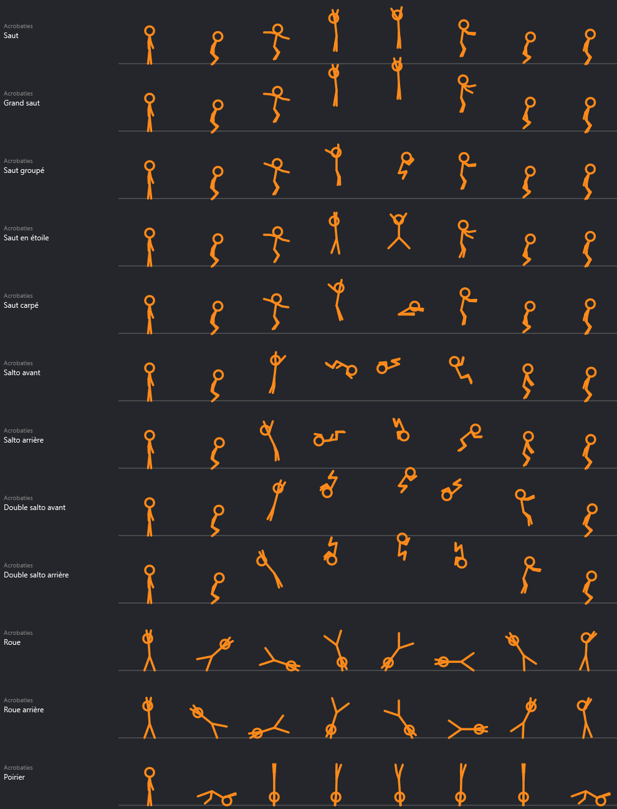
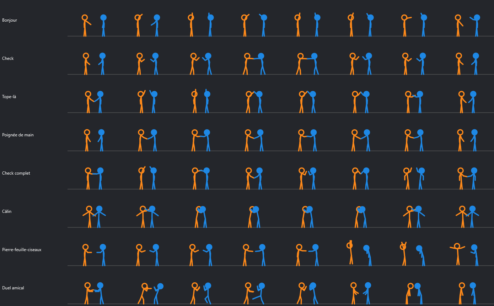

# Mascotte Stickman



Un bonhomme-bâton qui vit sur le bureau de Windows : il se promène, saute sur le haut des fenêtres, danse, se bat contre le curseur, bâtit des tours de blocs, s'envole en élytres… et on peut l'attraper à la souris pour le lancer. Il n'a aucune image : tout est dessiné par le programme à partir d'un squelette, ce qui permet de choisir sa couleur et de lui donner des centaines d'animations.

*A stick figure that lives on your Windows desktop: 520 animations, drawn entirely by code from a skeleton. He walks around, jumps onto your windows, dances to your music, fights the cursor, builds block towers, glides with elytra, and you can grab and throw him. Up to six of them at once, and they greet each other. Single exe, no install.*

> **Projet de fan, non officiel.** L'idée vient des animations où un stick figure s'échappe de son logiciel de dessin et sème la pagaille sur le bureau, celles d'Alan Becker en tête. Ce projet n'est ni créé ni approuvé par lui. Minecraft est une marque de Mojang ; ce projet n'y est pas affilié et ne contient aucun fichier du jeu.

## Installer

Télécharger `MascotteStickman.exe` dans les [Releases](../../releases) et le lancer. Windows 10 ou 11, rien d'autre à installer.

L'exe n'est pas signé : Windows peut afficher « Windows a protégé votre ordinateur ». Cliquer sur *Informations complémentaires* puis *Exécuter quand même*.

## Ce qu'il fait

- **Clic droit** : couleur, animations rangées par famille, amis, paramètres, mode muet, lancement au démarrage de Windows, quitter.
- **Couleur et tête** : 16 teintes ou n'importe quelle couleur. La tête est un disque plein, sauf pour l'orange, le noir et le rouge sombre où c'est un anneau ; un réglage force l'un ou l'autre.
- **520 animations** : déplacements, danses (20 mouvements de bras × 8 de jambes), gestes, combat, acrobaties, sport, vie quotidienne, émotions, et quelques-unes réservées au bord des fenêtres (assis, jambes dans le vide, pêche à la ligne). Une quarantaine d'accessoires dessinés par le programme : épée, marteau, guitare, parapluie, balai…
- **Souris** : on l'attrape, on le balance, on le lance ; il se bat contre le curseur s'il s'approche, et un curseur trop rapide l'envoie valser.
- **Fenêtres** : il saute sur le haut des fenêtres (saut simple, salto ou atterrissage de héros), voyage avec elles, retombe si elles se ferment, et peut se téléporter.
- **Amis** : jusqu'à six stickmen à la fois (clic droit → *Amis* → *Ajouter un stickman*), chacun de sa couleur. Ils vont se voir d'eux-mêmes, même perchés sur des fenêtres différentes : bonjour, check, tope-là, poignée de main, check complet, câlin, pierre-feuille-ciseaux, duel amical, danse à deux.



- **Musique** : quand le PC joue de la musique, il lui prend de temps en temps l'envie de danser, et sa danse suit le tempo. Il lit seulement le niveau du son qui sort du PC (comme l'indicateur de volume de Windows) : rien n'est enregistré.
- **Minecraft** : des scènes entières. Il monte une tour ou un escalier de blocs sous ses pieds puis saute dans le vide, s'envole en élytres, amortit une chute immense avec un seau d'eau, lance une perle de l'Ender et s'y téléporte, allume une TNT qui souffle toute la bande, tire un feu d'artifice, traverse un portail du Nether ; et aussi : pioche, établi, lit, wagonnet, bateau, trampoline de slime…
- **Mode farceur** (désactivé par défaut) : de temps en temps, il saute sur une fenêtre, marche jusqu'à sa croix et appuie dessus avec la main. C'est un vrai clic sur la croix : un programme qui a du travail non enregistré demande encore confirmation, mais un jeu ou une vidéo se ferment aussitôt. Il épargne la fenêtre en cours d'utilisation (réglable), prévient par une bulle, et il suffit de l'attraper à la souris pour l'en empêcher.
- **Sons** : 14 bruitages calculés par le programme, sans aucun fichier audio. Volume et familles de sons réglables, et un **mode muet** dans le menu pour tout couper d'un coup.
- **Paramètres** : une fenêtre à onglets, plus de 80 réglages et une case par animation.

## Les textures de Minecraft

Les blocs et les objets des scènes Minecraft s'affichent avec les vraies textures du jeu, au pixel près, **si Minecraft (Java) est installé sur le PC** : le programme les lit directement dans le jeu (le `.jar` de la version la plus récente, dans `.minecraft\versions`). Rien n'est copié dans l'exe ni dans ce dépôt.

Sans Minecraft, ou si la case *Vraies textures de Minecraft* est décochée (Paramètres → Apparence), les blocs sont dessinés par le programme et les objets remplacés par des formes simples.

## Le piloter depuis la ligne de commande

```
MascotteStickman.exe --jouer "Salto avant"
MascotteStickman.exe --jouer "Tour de blocs"
MascotteStickman.exe --jouer "@amis 3"
MascotteStickman.exe --jouer "@duo Check"
MascotteStickman.exe --planches dossier
```

`--jouer` s'adresse au stickman déjà lancé : un nom d'animation, ou une commande (`@amis N`, `@duo nom`, `@musique`, `@fenetre`, `@reglages`, `@couleur RRVVBB`). `--planches` écrit des planches de contrôle : chaque animation en huit images (`--planches dossier duos` pour les animations à deux).

Ses réglages sont dans `%LOCALAPPDATA%\MascotteStickman`.

## Compiler

```
powershell -ExecutionPolicy Bypass -File construire.ps1
```

Le script utilise le compilateur C# livré avec Windows (.NET Framework 4) : rien à installer.

- `src/Stickman.cs` : le moteur (squelette, dessin, physique du lancer, fenêtres, amis, scènes, sons, paramètres).
- `src/StickmanAnimations.cs` : la bibliothèque d'animations. Une pose s'écrit en treize nombres (torse, tête, épaules, coudes, hanches, genoux, hauteur, rotation, décalage) ; les marches et les danses sont fabriquées par des générateurs.
- `src/StickmanOreille.cs` : l'écoute du niveau sonore et le calcul du tempo.

Il a d'abord vécu dans le dépôt [Mascotte Claude](https://github.com/Minecraft-2048/mascotte-claude), avec les autres mascottes.

## Licence

MIT, voir [LICENSE](LICENSE).
